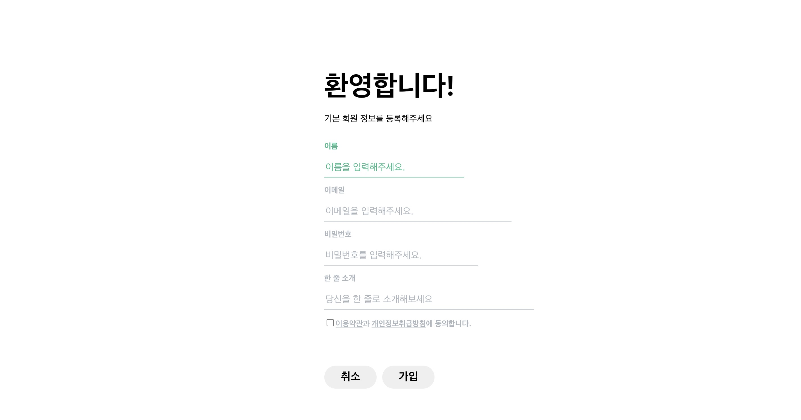

# Velog 회원가입 페이지 클론 코딩

이 프로젝트는 Velog 회원가입 페이지를 클론 코딩한 것입니다. JSX와 styled-components를 사용하여 UI를 구현하였으며, 기존 Velog 페이지와 유사한 사용자 경험을 제공하는 것을 목표로 했습니다.

## 주요 기능

- **JSX**: React에서 HTML 요소를 구성하여 유연한 UI 구현
- **Styled-components**: 컴포넌트별로 스타일을 작성하여 코드의 재사용성과 가독성 향상
- **Velog 회원가입 페이지 클론**: 실제 Velog 페이지를 기반으로 한 디자인 및 레이아웃

## 미리 보기



## 설치 및 실행

```bash
# 패키지 설치
npm install

# 로컬 서버 실행
npm start

